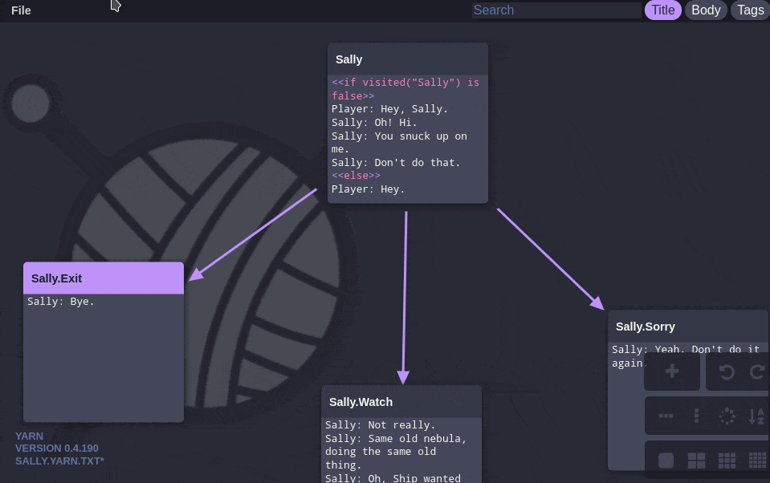
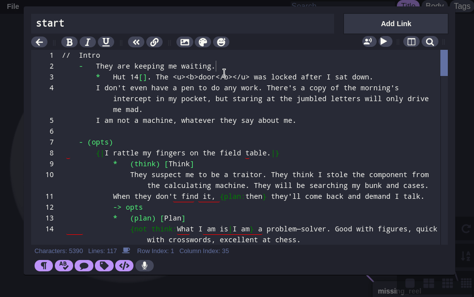

# 🚨 This project is going through planned refactoring and re-evaluation of goals.

This project's playtesting and syntax highlighting is not fully compatible with Yarn Spinner 2. Please use the [Yarn Spinner Extension for Visual Studio Code](https://marketplace.visualstudio.com/items?itemName=SecretLab.yarn-spinner) if you need those features and have vscode instead.

To learn more about Yarn Spinner 2, please see the [Yarn Spinner documentation](https://docs.yarnspinner.dev). Yarn Spinner 2 is free and open source, and contains fantastic improvements over Yarn Spinner 1!
To learn more, please join the friendly [Yarn Spinner Discord community](https://discord.gg/yarnspinner)!

This project's future goals are changing!
- While the vscode extension is going to be used by professional developers, this version will remain to target the casual user. It has a much smaller footprint and can run on anything from the browser or as an installed PWA. We will take steps to continue that trend and slim it down
- Ability to save your work in the cloud will remain and be improved, so you can edit your work from a smartphone or a tablet on the go, without having to move files manually.
- Electron version is going to be deprecated in favor of the PWA version. You can still install the PWA version on your computer or mobile device by clicking on the "Add to home screen" button on the bottom. The PWA version will be on par feature wise with electron and have a smaller footprint on the user's computer. This will also make the project easier to maintain. The pwa api of chromium now supports all that it needs
- Extensibility will be improved by introducing a new extension api. The code needs to be simplified and organised a bit.
---


# Yarn Classic 🐱 🧺

Dialogue editor created for "Night in the Woods" (and other projects) by @blurymind, @NoelFB and @infinite_ammo with contributions from @seiyria and @beeglebug. It is heavily inspired by and based on the amazing Twine software: http://twinery.org/
It supports editing, syntax highlighting and testing for [Yarn](https://github.com/YarnSpinnerTool/YarnSpinner) and [InkleStudio Ink files](https://github.com/inkle/ink) syntax files.
It can also export from Yarn to [twine](https://twinery.org/) and use [github gist](https://gist.github.com/)for cloud backup!

# 🧶 Live Web APP (Use it in the browser)
<a href="https://blurymind.github.io/YarnClassic">https://blurymind.github.io/YarnClassic/</a>
<br/>
<a href="https://blurymind.github.io/YarnClassic/"></a>

# 📲 Install the App on your compuer or mobile device
1. Visit <a href="https://blurymind.github.io/YarnClassic/">https://blurymind.github.io/YarnClassic/</a>
<br/> with your web browser (chrome, chromium, opera, brave, or edge - any chromium based browser ideally)
2. Open the web browser's menu and select "Add to home screen"
3. When you run Yarn from the home screen, it will work in full screen mode, even when you are offline!
<br/>
<a href="https://blurymind.github.io/YarnClassic/"></a>

#  📁 Supported formats:
-  yarn 1 format open/save (json and yarn) <a href="https://blurymind.github.io/YarnClassic/?gist=1252aaa8f74a394b3ac5695107f16e51&fileName=yarnExample.json">Example</a> (playtesting supported)
-  ink format open/save <a href="https://blurymind.github.io/YarnClassic/?gist=1252aaa8f74a394b3ac5695107f16e51&fileName=inkSample.ink">Example</a> (playtesting supported)
-  renpy format save <a href="https://blurymind.github.io/YarnClassic/?gist=1252aaa8f74a394b3ac5695107f16e51&fileName=exportAsRenpyExample.json">Example</a>
-  twine (twee/twee2) open/save <a href="https://blurymind.github.io/YarnClassic/?gist=1252aaa8f74a394b3ac5695107f16e51&fileName=yarnExample.json">Example</a>
- <a href="https://blurymind.github.io/YarnClassic/?gist=1252aaa8f74a394b3ac5695107f16e51&fileName=bbcodeTags.yarn">bbcode</a> and <a href="https://blurymind.github.io/YarnClassic/?gist=1252aaa8f74a394b3ac5695107f16e51&fileName=htmlTags.yarn">html/xml</a> tag styling support

# Ability to save to the cloud (gist)
- Examples are hosted on gist https://gist.github.com/blurymind/1252aaa8f74a394b3ac5695107f16e51 to make a share link you do:

https://blurymind.github.io/YarnClassic/?gist=gistIdHere&fileName=yourFilename.ext

with gistId=1252aaa8f74a394b3ac5695107f16e51 and fileName=yarnExample.json in that gist, you do:

https://blurymind.github.io/YarnClassic/?gist=1252aaa8f74a394b3ac5695107f16e51&fileName=yarnExample.json

Just replace this with your private or public gist and the file in it you want to share - to create a link

#  💻 Install it on your desktop
 Please follow the steps for the PWA version of the app, as the electron one will be deprecated later this year

# 🚧 Roadmap
You can see planned features, vote for features or see how you can contribute at the roadmap here:
https://trello.com/b/ZXhhOzDl/yarn-roadmap

# 🎮 Game engines that bundle Yarn Classic
There are a few game engines that have Yarn Classic bundled with their IDE. That means that you can use it straight in those engines, without need to save files and open files and so on. It's directly integratedin their workflow!

- Gdevelop : A full-featured, open-source game development software, allowing to create HTML5 and native games without any knowledge in a specific programming language. All the game logic is built up using an intuitive and powerful event-based system.
https://github.com/4ian/GDevelop


# 🧠 Yarn runtimes
The runtime is a library that allows your game engine to parse the files that yarn creates. There are a couple of popular ones that you can use. If you have created a runtime, you are working on one or want to get one included with your game engine, these can be of some use to you

- YarnSpinner : A C# library for interactive dialogue in games! Ideal  if you are using Unity3d or another C# game engine!
https://github.com/YarnSpinnerTool/YarnSpinner

- Bondagejs : A Javascript-based parser for the Yarn dialogue tree markup language. Ideal if your game engine uses html5 technologies to run (Gdevelop and ctjs use it).
https://github.com/hylyh/bondage.js

- GDYarn : A Yarn runtime for Godot engine - completely written in Gdscript
https://github.com/kyperbelt/GDYarn

- Chatterbox : Yarn runtime implementation for Game maker 2+
https://github.com/JujuAdams/Chatterbox

# Other implementations of Yarn Editor
- Crochet : Fork of YarnClassic
https://github.com/FaultyFunctions/Crochet/

- YarnSpinner Loom vscode extension : implementation of YarnClassic as a vscode extension
https://marketplace.visualstudio.com/items?itemName=TranquilMarmot.yarn-spinner-loom

# 🐬 Features 🦄

### Portability
- Yarn Classic has PWA version you can install and run when offline, which has a much smaller footprint than other editors using electron.
- The pwa can run on mobile devices with smaller screens - you can use it on your phone and it's much easier to install.
- There is of course also an electron version of the editor, which is slower on updates but more stable

### BBcode and HTML-ish markup styling in editor, Spellchecking, Autocompletion, and more!
- Optional syntax autocompletion (autoclose tags)
- preview of bbcode/html tag effects and goto in trimmed nodes
- optional word guessing and autocompletion
- optional preview bbcode in editor mode
- a color picker (using spectrum.js) to set font color in bbcode
- emoji picker to insert emojis
- nodelink suggestions as you type in the right places
- Night mode - Toggling it will invert all the light colors which the editor currently uses
- A context menu command to visit other nodes via their links in the editor and even create new ones
- Button to go back to the previous edited node. If there is no previous - save and close the current one


### Language, writing and debugging tools built right into it (Yarn and Ink)
- Ability to playtest [Yarn](https://github.com/YarnSpinnerTool/YarnSpinner) and [Ink](https://github.com/inkle/ink) stories you are working on - straight inside the editor

- Spellchecking of words (supported for different languages too)
- misspelled word suggestions in the new context menu - if you have selected a misspelled word
- Similar word suggestion for highlighted words (supported for english only)
- Transcribe text - ability to "talk" to yarn without using hands :o (multi-language supported)
- Yarn can also talk to you - tell you what is written (multi-language supported)
- Support for compilation and debugging of ink files via the wasm port inklecate. It catches the error and opens the knot containing it when exporting or testing!


### Load and Save your yarns from your computer, github gists or anything you can send it to on your tablet/phone
- A variety of export formats supported - yarn, json yarn, twee, twee2, xml
- When used from a mobile device, yarn can send its data to any other app, including to google drive
- Ability to store and load all your yarns using a github gist - private or public, doesn't matter ;)

### Customization!
- Support for different themes (you can make your own too)

# ⚙️ Compile and run web app on localhost:
Make sure you have nodejs installed. Then from the root folder
```
npm install

npm start
```
You can access it on your smartphone too if it is on the same wifi network

# To build web app:
```
npm run build

```
you will find it in the /dist folder

# To compile and run electron app:
First of all you need to have compiled the web app (see previous steps)
```
cd electron

npm install

npm start
```

# To build an electron yarn executable yourself:
```
cd electron

npm run build-windows

or

npm run build-linux
```

# 😮 Examples

Games built using Yarn.

A short hike: https://store.steampowered.com/app/1055540/A_Short_Hike/


Night in the woods: https://store.steampowered.com/app/481510/Night_in_the_Woods/


Lost Constellation: http://finji.itch.io/lost-constellation


Knights and Bikes: https://store.steampowered.com/app/592480/Knights_And_Bikes/


Far From Noise by George Batchelor (@georgebatch): https://store.steampowered.com/app/706130/Far_from_Noise/


YarnTest: http://hayley.zone/bondage.js/

Test drive your Yarn files here ^

# How to Connect Nodes

Node connections work similar to Twine.
[[ask question|question]] leads to "question" node.


# How to Import Twine Files

One way to import Twine files into Yarn is to export a "Twee" file from Twine. (txt format) Open this txt file in Yarn as you would any other file.

Note: This method of importing will not preserve node locations, just each node's title, body and tags.

# How to Run Your Dialogue in Unity

You can find basic Yarn parsing and playback example code here:

https://github.com/InfiniteAmmoInc/yarn-test

You can find a more advanced Yarn interpreter here:

https://github.com/YarnSpinnerTool/YarnSpinner

# Yarn Icon

Yarn logo/icon created by @Mr_Alistair.


